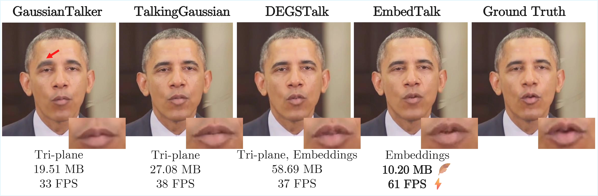
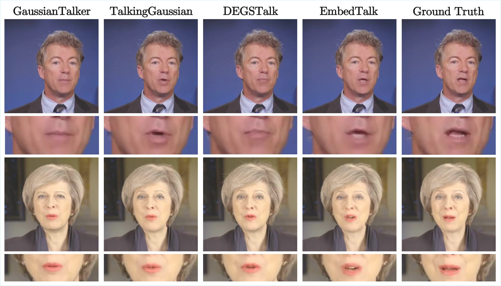
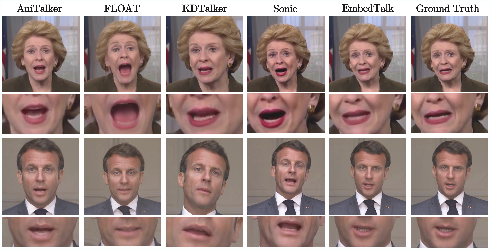

<div style="text-align:center; font-size:35px; font-weight:600; font-family:Jost;margin-bottom:1rem;">EmbedTalk:Talking Head Synthesis using Gaussian Embeddings</div>

<div style="text-align:center; font-size:20px; font-weight:500; font-family:Jost;"><a href="https://eps.leeds.ac.uk/computing/pgr/11951/arpita-saggar" target="_blank">Arpita Saggar</a><sup>1</sup>, <a href="https://medicinehealth.leeds.ac.uk/medicine/staff/257/dr-jonathan-darling" target="_blank">Jonathan C. Darling</a><sup>2</sup>, <a href="https://eps.leeds.ac.uk/computing/staff/13320/dr-duygu-sarikaya" target="_blank">Duygu Sarikaya</a><sup>1</sup>, <a href="https://eps.leeds.ac.uk/computing/staff/84/professor-david-hogg" target="_blank">David C. Hogg</a><sup>1</sup></div>

<div style="text-align:center; font-size:20px; font-weight:400; font-family:Jost;margin-bottom:1rem;"><sup>1</sup>School of Computer Science, University of Leeds<br><sup>2</sup>Leeds Institute of Medical Education, School of Medicine, University of Leeds</div>

<div style="text-align:center; font-size:20px; font-weight:600; font-family:Jost;">Preprint</div>

<div class="center-button">
  <a href="https://arxiv.org/abs/2603.07604" target="_blank" class="btn btn-primary rounded-pill m-1" role="button" style="font-weight:500; font-family:Jost;"><i class="fa-solid fa-file"></i> Paper</a>
  <a href="https://github.com/arpita2512/EmbedTalk" target="_blank" class="btn btn-primary rounded-pill m-1" role="button" style="font-weight:500; font-family:Jost;"> Code</a>
</div>

<div style="text-align:center; font-size:18px; font-weight:450; font-family:Jost; line-height: 1; margin-bottom:1rem;"><b>TL;DR:</b> We present EmbedTalk, a new framework for 3DGS-based talking head synthesis. EmbedTalk models speech deformations using learnable per-Gaussian embeddings, resulting in better lip-sync and reduced computational costs compared to tri-plane-based methods.</div>



## Introduction

<div class="text">Lorem ipsum dolor sit amet consectetur adipiscing elit. Quisque faucibus ex sapien vitae pellentesque sem placerat. In id cursus mi pretium tellus duis convallis. Tempus leo eu aenean sed diam urna tempor. Pulvinar vivamus fringilla lacus nec metus bibendum egestas. Iaculis massa nisl malesuada lacinia integer nunc posuere. Ut hendrerit semper vel class aptent taciti sociosqu. Ad litora torquent per conubia nostra inceptos himenaeos.</div>

## Method

<div class="text">Lorem ipsum dolor sit amet consectetur adipiscing elit. Quisque faucibus ex sapien vitae pellentesque sem placerat. In id cursus mi pretium tellus duis convallis. Tempus leo eu aenean sed diam urna tempor. Pulvinar vivamus fringilla lacus nec metus bibendum egestas. Iaculis massa nisl malesuada lacinia integer nunc posuere. Ut hendrerit semper vel class aptent taciti sociosqu. Ad litora torquent per conubia nostra inceptos himenaeos.</div>


## Results

<div class="text">Lorem ipsum dolor sit amet consectetur adipiscing elit. Quisque faucibus ex sapien vitae pellentesque sem placerat. In id cursus mi pretium tellus duis convallis. Tempus leo eu aenean sed diam urna tempor. Pulvinar vivamus fringilla lacus nec metus bibendum egestas. Iaculis massa nisl malesuada lacinia integer nunc posuere. Ut hendrerit semper vel class aptent taciti sociosqu. Ad litora torquent per conubia nostra inceptos himenaeos.</div>





## Acknowledgements

<div class="text">AS is supported by a PhD studentship that is funded by UK Research and Innovation (CDT Grant Reference: EP/S024336/1). This work was undertaken on the Aire HPC system at the University of Leeds, UK.</div>

## BibTeX

```bibtex
@misc{saggar2026embedtalktriplanefreetalkinghead,
      title={EmbedTalk: Talking Head Synthesis using Gaussian Embeddings}, 
      author={Arpita Saggar and Jonathan C. Darling and Duygu Sarikaya and David C. Hogg},
      year={2026},
      eprint={2603.07604},
      archivePrefix={arXiv},
      primaryClass={cs.CV},
      url={https://arxiv.org/abs/2603.07604}, 
}
```