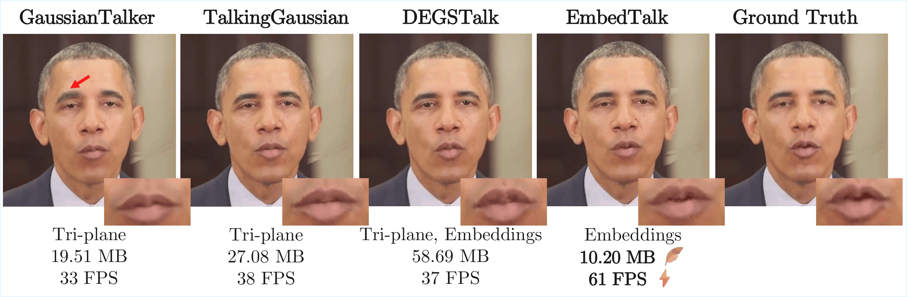
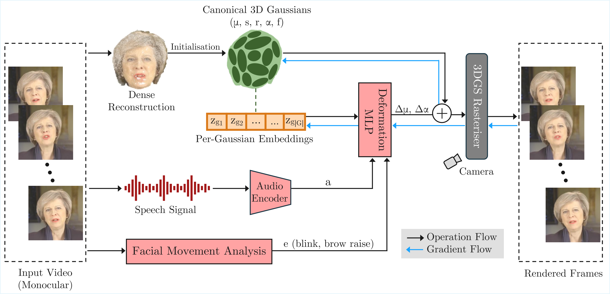
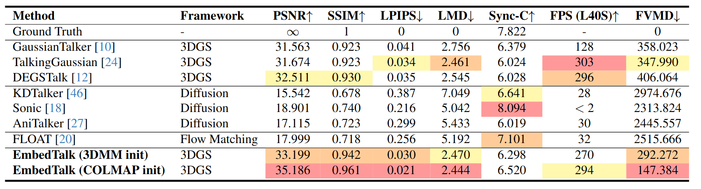
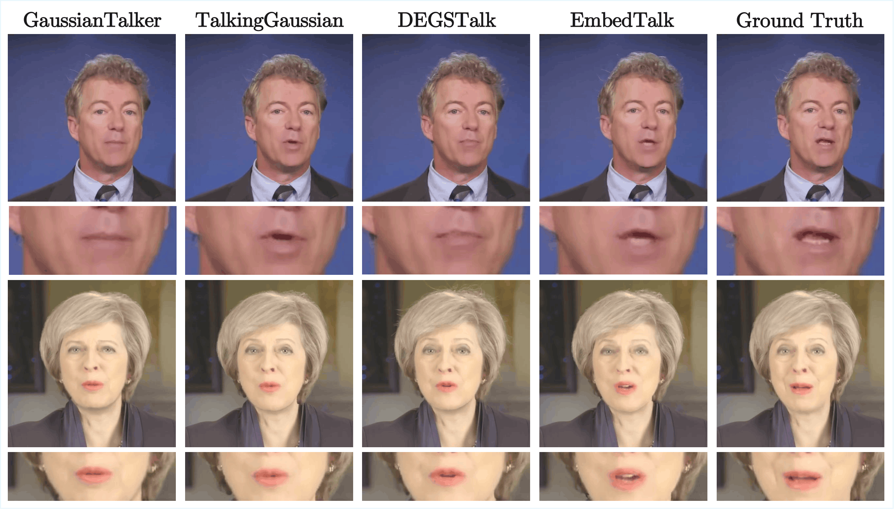
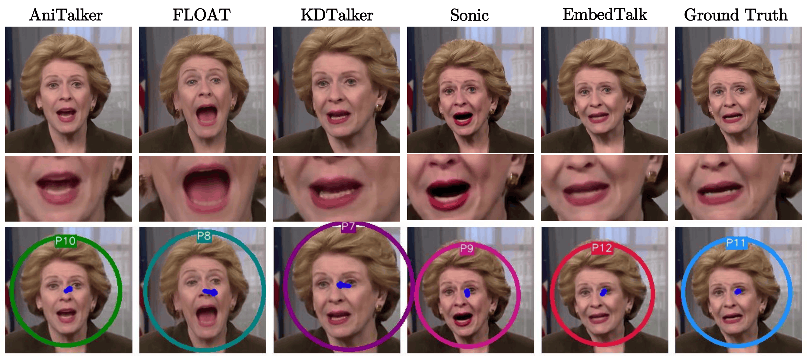
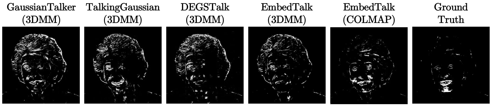

<div style="text-align:center; font-size:35px; font-weight:600; font-family:Jost;margin-bottom:1rem;">EmbedTalk: Talking Head Synthesis using Gaussian Embeddings</div>

<div style="text-align:center; font-size:20px; font-weight:500; font-family:Jost;"><a href="https://eps.leeds.ac.uk/computing/pgr/11951/arpita-saggar" target="_blank">Arpita Saggar</a><sup>1</sup>, <a href="https://medicinehealth.leeds.ac.uk/medicine/staff/257/dr-jonathan-darling" target="_blank">Jonathan C. Darling</a><sup>2</sup>, <a href="https://eps.leeds.ac.uk/computing/staff/13320/dr-duygu-sarikaya" target="_blank">Duygu Sarikaya</a><sup>1</sup>, <a href="https://eps.leeds.ac.uk/computing/staff/84/professor-david-hogg" target="_blank">David C. Hogg</a><sup>1</sup></div>

<div style="text-align:center; font-size:20px; font-weight:400; font-family:Jost;margin-bottom:1rem;"><sup>1</sup>School of Computer Science, University of Leeds<br><sup>2</sup>Leeds Institute of Medical Education, School of Medicine, University of Leeds</div>

<div style="text-align:center; font-size:20px; font-weight:600; font-family:Jost;">Preprint</div>

<div class="center-button">
  <a href="https://arxiv.org/abs/2603.07604" target="_blank" class="btn btn-primary rounded-pill m-1" role="button" style="font-weight:500; font-family:Jost;"><i class="fa-solid fa-file"></i> Paper</a>
  <a href="https://github.com/arpita2512/EmbedTalk" target="_blank" class="btn btn-primary rounded-pill m-1" role="button" style="font-weight:500; font-family:Jost;"> Code</a>
  <a href="https://drive.google.com/file/d/1Ia0NLliUB3ktwqlUtceUeEj5DWv6E3sE/view?usp=sharing" target="_blank" class="btn btn-primary rounded-pill m-1" role="button" style="font-weight:500; font-family:Jost;"><i class="fa-solid fa-video"></i> Supplementary Video</a>
</div>

{width=80%}

## Introduction

<div class="text">Synthesising audio-driven talking heads in real-time is an important task for film production, teleconferencing, and virtual assistants. Generating talking heads with 3D Gaussian Splatting involves deforming a canonical Gaussian representation using the speech signal. Prior work uses 2D planes to encode the 3D Gaussians and compress the associated deformation field. However, tri-plane representations suffer from mirroring artefacts caused by feature entanglement between subspaces. Tri-planes also introduce approximation errors that hamper audio-visual alignment, as shown above. Prior work has demonstrated the superiority of learnable embeddings for modelling Gaussian deformations in 4D (3D + time) scene reconstruction (E-D3DGS; ECCV'24). In this work, we extend the embedding-based deformation paradigm to talking head synthesis. We introduce **EmbedTalk**, which leverages per-Gaussian embeddings to generate stable talking heads with high audio-visual alignment. Quantitive and qualitative assessments establish EmbedTalk's superiority in facial fidelity, lip-synchronisation, and motion consistency compared to previous 3DGS-based works. Furthermore, by generating mouth movements consistent with an identity's style, our method achieves higher realism than state-of-the-art generative models that often exaggerate motion.</div>

## Method

<div class="text">EmbedTalk begins with a talking portrait video. The video frames enable a dense reconstruction of the head that initialises the 3D Gaussians. Each Gaussian is also associated with a learnable embedding $z_g$. For each frame, the corresponding speech signal $a$ and upper-face movements $e$ are fed into the deformation MLP, along with a positional encoding of $z_g$ to predict the Gaussian deformations ($\Delta\mu, \Delta\alpha$). The deformed Gaussians are passed to the rasteriser, along with the viewing direction (camera), to render the head onto the combined torso and scene background.</div>



## Results

<div class="text">We compare our approach with recent 3DGS-based methods: TalkingGaussian (ECCV'24), GaussianTalker (ACM MM'24) and DEGSTalk (ICASSP'25). To contextualise our work beyond 3DGS-based synthesis, we also compare EmbedTalk with state-of-the-art image-based generative methods: AniTalker(ACM MM'24), FLOAT (ICCV'25), KDTalker (IJCV'25) and Sonic (CVPR'25).</div>

<div class="text">Videos are rendered under two different settings. The first is the **self-driven** setting, where videos generated for an identity are driven by unseen speech sourced from the same identity. The second is the **cross-driven** setting, where videos are generated using: (1) speech from other identities, and (2) synthetic speech created using a text-to-speech (TTS) model. For this, we source human speech from the HDTF (High-Definition Talking Face) dataset, and generate AI samples using the voices from ElevenLabs TTS. The text for the TTS model is taken from the works of William Shakespeare.</div>

### Quantitative Comparison



### Qualitative Comparison

#### 

{width=90%}

#### 

{width=90%}

#### 

{width=90%}

## Acknowledgements

<div class="text">AS is supported by a PhD studentship that is funded by UK Research and Innovation (CDT Grant Reference: EP/S024336/1). This work was undertaken on the Aire HPC system at the University of Leeds, UK. We are grateful to Professor Vania Dimitrova for helpful comments on the presentation of results.</div>

## BibTeX

```bibtex
@misc{saggar2026embedtalktalkingheadsynthesis,
      title={EmbedTalk: Talking Head Synthesis using Gaussian Embeddings}, 
      author={Arpita Saggar and Jonathan C. Darling and Duygu Sarikaya and David C. Hogg},
      year={2026},
      eprint={2603.07604},
      archivePrefix={arXiv},
      primaryClass={cs.CV},
      url={https://arxiv.org/abs/2603.07604}, 
}
```